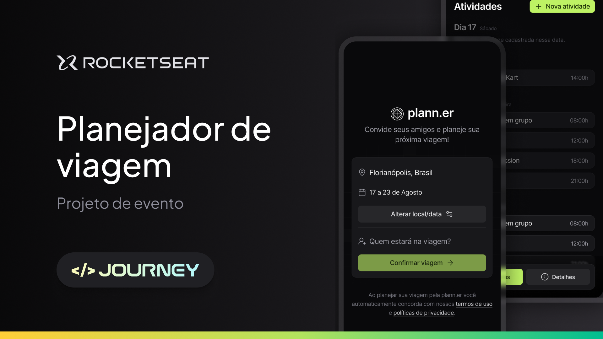

# Planner App
- The project is a desktop site for making travel plans with friends, registering activities and useful links.
- This is one of the projects from Rocketseat's NLW Journey event where I was able to learn a lot about React Native, NodeJS and also add authorial details to the project.
---

## Project UI
- The project's user interface was developed by [Rocketseat](https://github.com/rocketseat-education)


[Project Figma](https://www.figma.com/design/j9qsK8JYewcbhg7uOQSU1A/NLW-Journey-%E2%80%A2-Planejador-de-viagem-(Community)?node-id=0-1&node-type=canvas&t=SxvcPZXMh9qHVXij-0)


## Stacks

This project used the following stacks on the front:

- 
- 
- 
- 
- 
- 
- 
- 
- 


## Installation

- Clone the project repository with:

```bash
  git https://github.com/PedroHenrique1606/plannerapp.git
  cd plannerapp
```
- Install my-project with npm and start project with npx
    
```bash
  npm install
  npx expo start
```
    